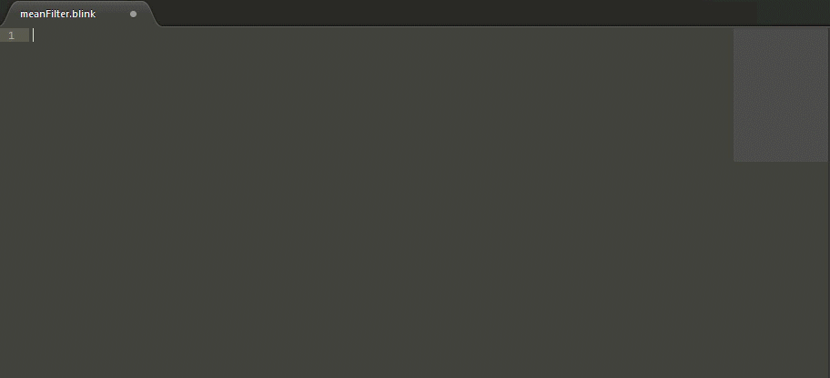
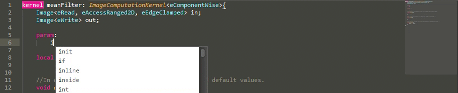
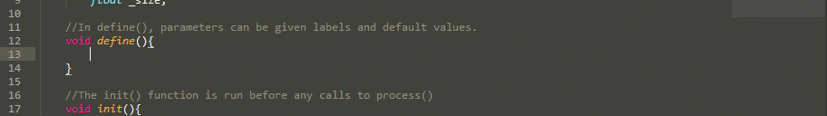
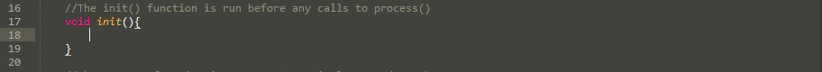
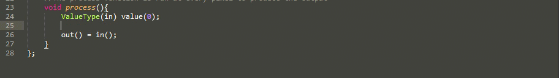

# BlinkScript - Sublime text
This package includes syntax highlighting and autocompletion for the [Foundry's **Nuke**](https://www.foundry.com/products/nuke) [BlinkScript](https://learn.foundry.com/nuke/content/reference_guide/other_nodes/blinkscript.html).

## Installation
Clone this repository in your sublime package folder.
- direct link: https://github.com/diegoinacio/blinkScript-sublime

*It's also available in [**Package Control**](https://packagecontrol.io)*.

## Features
- **Kernel Snippet**: Constructs a basic structure of a BlinkScript.

- **Reserved Keywords**: Much of reserved words and functions was implemented for highlighting and autocompletion.

- **BlinkScript Functions**: BlinkScript's native functions was implemented too with passing through the variables.

- **Example**: Snippet 'for loop' gives a very practical way to implement loops with multiple editing and passing through the parameters.

